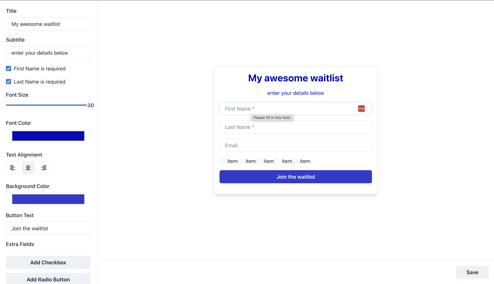

# 🚀 Form Widget Editor 🎨

Welcome to the most fabulous Form Widget Editor in the galaxy! 🌌 Unleash your creativity, customize your form widgets, and watch them come to life in real-time. Built with love, React, TypeScript, Next.js, Chakra UI, and PlanetScale.

## 🎥 Demo Video:

To get a better understanding of how the Form Widget Editor works, watch the demo video below:

[](https://www.youtube.com/watch?v=4KTsjtjGkWY "Form Widget Editor Demo")

Click on the image above to play the video.

## 🌈 Features:

- **Dynamic Preview**: What you see is what you get, in real-time!
- **Stylish Sidebar**: Customize titles, subtitles, fonts, and more.
- **Extra Fields**: Add checkboxes, radio buttons, and dropdowns. The more, the merrier!
- **Background Magic**: Our diligent background workers craft the perfect HTML for you.

## 🛠️ Setup & Installation:

1. **Clone the Universe**:
   ```
   git clone https://github.com/Fato07/viralLoops-form-widget-editor.git
   ```
2. **Go into the Universe**:
   ```
   cd form-widget-editor
   ```
3. **Create a `.env` file and add the secrets sent to you via email**
   
4. **Install The Stars**
   ```
   yarn install
   ```
5. **Setup Database that stores widget Settings**:
  
   i. Connect Prisma to the PlanetScale database. The databse url is defined as `DATABASE_URL` in your `.env file`.

   ii. now run `npx prisma generate`

6. **Run the Project**:
   ```
   Yarn dev
   ```
7. Visit the Cosmos: Open your browser and navigate to http://localhost:3000. Witness the magic! 🪄

8. Message Qeue and Backgorund Worker
   
   #### This is the initial background worker setup on local host only
   i. Ensure you have [ts-node](https://www.npmjs.com/package/ts-node) installed and run the following command

   ```
   ts-node -P tsconfig.worker.json worker.ts --watch
   ```

   ### Moving into Deployment...
   since the initial background worker created is a long polling task that listens to a redis queue. It was bit of a bottle neck to deploy such as the deploymnet options for that would require time to configure.

   I therefore considerd triggering the background worker on demand and migrated it to become a serverless function.

## 🚀 Why This Tech Stack?
 - ### Next.js:
   Provides a seamless development experience with hot-reloading, server-side rendering, and a plethora of plugins.
 - ### Chakra UI:
   For a beautiful and accessible UI without the fuss.
 - ### PlanetScale: 
   A serverless relational database that scales effortlessly with the needs of our application.
 - ###  Prisma:
   An open-source database toolkit that makes it easy to reason about our data and ensures type safety.

 - ### Upstash: Redis in the Cloud

   **Why Upstash?**

   Upstash provides a serverless Redis database, which is perfect for the app's needs. Here's why:

   Upstash scales automatically with our usage. We don't have to worry about provisioning or managing servers.


   In the Form Widget Editor, we utilize Upstash as a message broker. When a user saves their form widget settings:

## 🧱 Behind the Scenes: How It Works 🕵️‍♂️:
   1. When you customize your widget, the settings are saved to our primary database (PlanetScale).
   2. A message is pushed into a Redis list in Upstash, signaling a background task. Think of this as ringing a bell for our background workers.
   3. The background workers are always listening. When it detects a message, it processes the task, such as generating the HTML widget.
   4. Once the task is complete, the message is removed from the list.

  This architecture ensures that even if there's a sudden surge in users or tasks, our main application remains responsive. The background workers can process tasks at their own pace, and we can easily scale up the number of workers if needed. ✨

## 📝 Notes:
The code can still be improved alot more, but due to time restrictions, i would leave that for another day, However, the main functionality and desired behaviour works as expected. Let me know if any isues.


   

   